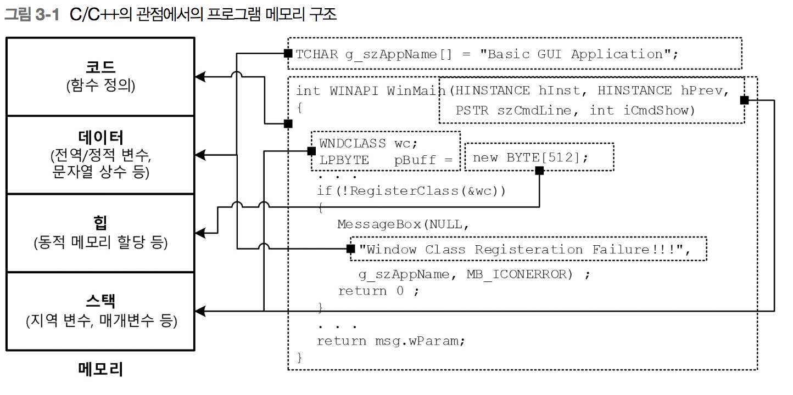
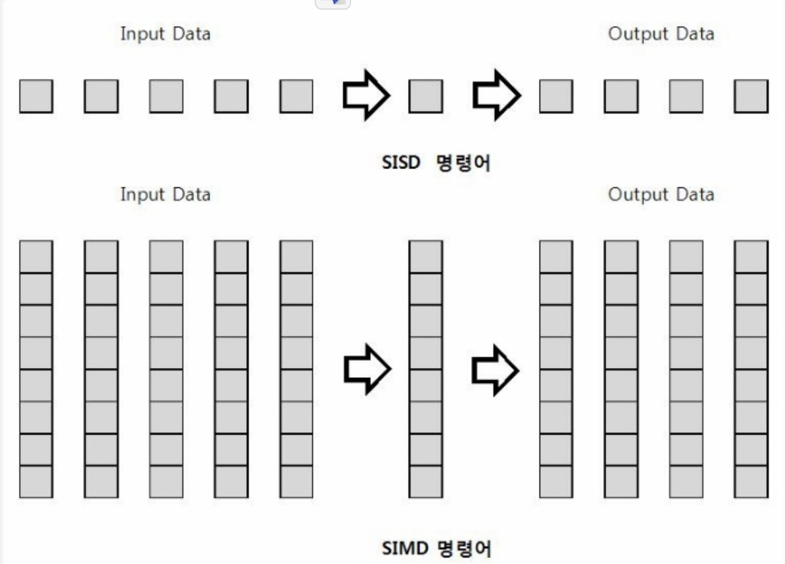

# 리버스 엔지니어링(2권_디버거 편)
___
## 1부 PE 입문
### 3장 코드와 데이터 섹션
+ PE 파일 = PE 헤더 + 코드 섹션 + 다양한 **데이터 섹션**
+ C/C++의 관점에서의 프로그램 메모리 구조
  * 이미지 출처 : 리버스 엔지니어링(1권 파일 구조편) p.168
  
+ 시스템은 PE(exe, dll, sys)를 로드하기 전에 프로세스를 위한 가상 주소 공간 \
  을 생성한 후, PE전체를 매핑하기에 충분한 주소 공간을 **예약(Reserve)**한다. \
  이때, 예약 크기는 IMAGE_OPTIONAL_HEADER의 **SizeOfImage**필드에 정의 되어 있다.
  그리고, PE를 매핑하면서 코드 섹션이나 데이터 섹션, 읽기 전용 데이터 섹션을 IMAGE_SESTION_HEADER
  구조체의 VirtualAddress필드가 가리키는 가상 주소 번지(**기준 주소 ImageBase + RVA**)에 VirtualSize
  필드 크기만큼 공간을 **확정(Commit)**한 후, 그곳에 PE 파일 내의 해당 섹션을 매핑 하면 그 공간 자체가 코드 영역과 데이터 영역이 된다.

___
## 4부 코드 분석
### 11장 어셈블리 언어 개요
+ IA-32 아키텍처와 AMD64 아키텍처가 지원하는 주요 기술은 다음과 같다.
  - 완전한 64비트 정수 수용
  - 범용 레지스터 추가
  - XMM(SSE) 레지스터 추가
    * 스트리밍 SIMD 명령에 사용되는 128비트 XMM 레지스터가 8개에서 16개로 늘어났다.
      * SIMD(Single Instruction Multiple Data)
        
      * FPU(Float Processing Unit)
        * 부동 소수점 연산기
      * MMX(MultiMedia eXtensions)
         * 멀티미디어 응용프로그램들의 실행을 빠르게 하기 위해서 설계된 인텔 펜티엄 프로세서이다.
         * 이전 마이크로 프로세서에 비해 달라진 점은 57개의 새로운 명령어(Instrution)이 추가 됐고 **SIMD**프로세서가 추가된 명령어로 여러개의 데이터 항목을 한꺼번에 수행 할 수 있도록 해준다.
         * MMX는 64bit 크기의 레지스터(MM0~MM7)를 사용하여 처리를 하는데 실제로 새로운 레지스터가 추가된 것이 아니라 **FPU**레지스터를 빌려 사용한다. (FPU 레지스터는 80bit이며 이중 16bit를 떼어낸 64bit를 사용하며 부동소수점 연산과 MMX 연산은 동시에 이루어 질 수 없다는 단점이 존재 한다.)
         * SSE가 탑재된 이후 실질적으로 MMX는 불필요해져 **인텔**은 응용프로그램 개발에서 최적화 시 MMX 사용을 자제할 것을 권한다. 처리 능력이 떨어지는 MMX 명령어는 주로 과거 자산과의 호환성을 목적으로 구현되어 제공 되고 있다.
  - 더 넓은 가상/물리 주소 공간 제공
  - 명령 포인터에 상대적인 데이터 접근
    * **AMD64**의 명령은 상대적인 메모리 참조를 통해서 명령 포인터(RIP 레지스터)에 데이터 접근을 할 수 있게 되었다. 이것은 공유 라이브러리나 런타임시 자주 사용되는 위치 독립적인 코드를 더 효율적으로 사용 가능하게 하며, 특히 기준 재배치 작업을 매우 쉽게 해준다.
      * 기준 재배치(PE 파일의 재배치(Relocation))
        * PE 파일(EXE/DLL/SYS)이 프로세스 가상 메모리에 로딩(Loading)될 때 PE 헤더의 **ImageBase**주소에 로딩 됩니다.
  - 확장된 SSE 명령 제공
    * **AMD64**는 인텔의 SSE와 SSE2를 코어 명령으로 채택했으며, 확장된 명령들을 제공한다.

+ IA-32 레지스터
  | 레지스터        | 이름           | 설명  |
  | ------------- |:-------------:| -----:|
  | EAX(AX)       | Accumlator    | 누산기 |
  | EBX(BX)       | Base          | 누산기 |
  | ECX(CX)       | Counter       | 누산기 |
  | EDX(DX)       | Data          | 누산기 |
  | EBP(BP)       | Base Pointer  | 누산기 |
  | ESI(SI)       | Source Index  | 누산기 |

___
