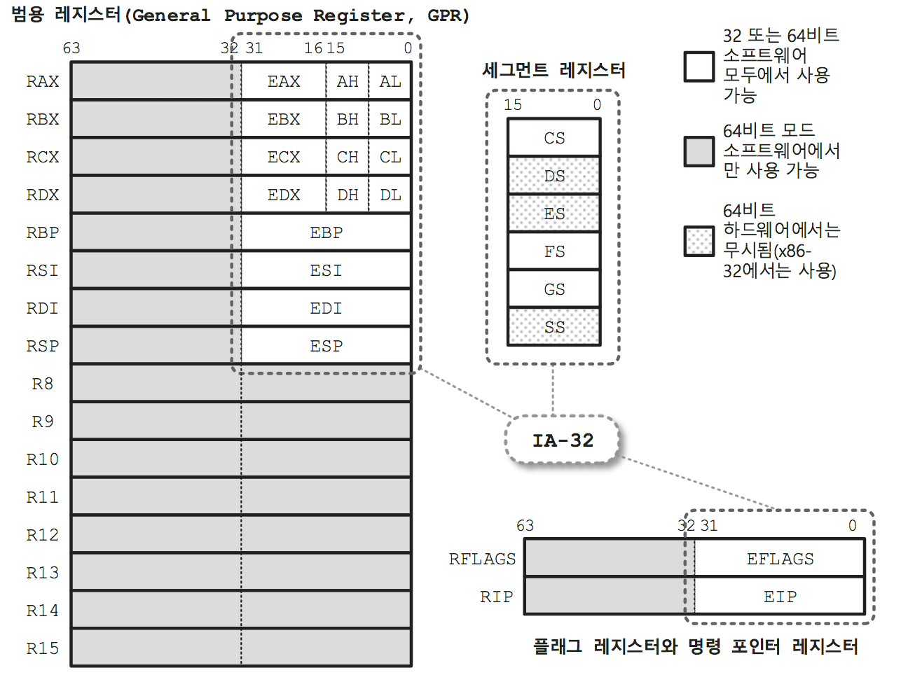

# 리버스 엔지니어링(2권_디버거 편)
___
## 1부 PE 입문
### 3장 코드와 데이터 섹션
+ PE 파일 = PE 헤더 + 코드 섹션 + 다양한 **데이터 섹션**
+ C/C++의 관점에서의 프로그램 메모리 구조
  * 이미지 출처 : 리버스 엔지니어링(1권 파일 구조편) p.168
  
+ 시스템은 PE(exe, dll, sys)를 로드하기 전에 프로세스를 위한 가상 주소 공간 \
  을 생성한 후, PE전체를 매핑하기에 충분한 주소 공간을 **예약(Reserve)**한다. \
  이때, 예약 크기는 IMAGE_OPTIONAL_HEADER의 **SizeOfImage**필드에 정의 되어 있다.
  그리고, PE를 매핑하면서 코드 섹션이나 데이터 섹션, 읽기 전용 데이터 섹션을 IMAGE_SESTION_HEADER
  구조체의 VirtualAddress필드가 가리키는 가상 주소 번지(**기준 주소 ImageBase + RVA**)에 VirtualSize
  필드 크기만큼 공간을 **확정(Commit)**한 후, 그곳에 PE 파일 내의 해당 섹션을 매핑 하면 그 공간 자체가 코드 영역과 데이터 영역이 된다.

___
## 4부 코드 분석
### 11장 어셈블리 언어 개요
+ IA-32 아키텍처와 AMD64 아키텍처가 지원하는 주요 기술은 다음과 같다.
  - 완전한 64비트 정수 수용
  - 범용 레지스터 추가
  - XMM(SSE) 레지스터 추가
    * 스트리밍 SIMD 명령에 사용되는 128비트 XMM 레지스터가 8개에서 16개로 늘어났다.
      * SIMD(Single Instruction Multiple Data)
        
      * FPU(Float Processing Unit)
        * 부동 소수점 연산기
      * MMX(MultiMedia eXtensions)
         * 멀티미디어 응용프로그램들의 실행을 빠르게 하기 위해서 설계된 인텔 펜티엄 프로세서이다.
         * 이전 마이크로 프로세서에 비해 달라진 점은 57개의 새로운 명령어(Instrution)이 추가 됐고 **SIMD**프로세서가 추가된 명령어로 여러개의 데이터 항목을 한꺼번에 수행 할 수 있도록 해준다.
         * MMX는 64bit 크기의 레지스터(MM0~MM7)를 사용하여 처리를 하는데 실제로 새로운 레지스터가 추가된 것이 아니라 **FPU**레지스터를 빌려 사용한다. (FPU 레지스터는 80bit이며 이중 16bit를 떼어낸 64bit를 사용하며 부동소수점 연산과 MMX 연산은 동시에 이루어 질 수 없다는 단점이 존재 한다.)
         * SSE가 탑재된 이후 실질적으로 MMX는 불필요해져 **인텔**은 응용프로그램 개발에서 최적화 시 MMX 사용을 자제할 것을 권한다. 처리 능력이 떨어지는 MMX 명령어는 주로 과거 자산과의 호환성을 목적으로 구현되어 제공 되고 있다.
  - 더 넓은 가상/물리 주소 공간 제공
  - 명령 포인터에 상대적인 데이터 접근
    * **AMD64**의 명령은 상대적인 메모리 참조를 통해서 명령 포인터(RIP 레지스터)에 데이터 접근을 할 수 있게 되었다. 이것은 공유 라이브러리나 런타임시 자주 사용되는 위치 독립적인 코드를 더 효율적으로 사용 가능하게 하며, 특히 기준 재배치 작업을 매우 쉽게 해준다.
      * 기준 재배치(PE 파일의 재배치(Relocation))
        * 실행 파일을 로드할 때 선호되는(preferred) 번지에 실행 파일 이미지를 로드 한다. 만약, 로드할 이미지를 선호되는 번지에 매핑하고자 할 때 이미 그 번지가 사용 중이어서 해당 번지로 로드 하지 못하는 경우 매핑 가능한 다른 번지에 해당 이미지를 매핑 하는 과정이 **기준 재배치** 작업 이다.
          * RVA(Relative Virtual Address)
            * **ImageBase**에서 부터의 상대주소이다.
          * VA(Virtual Address)
            * 가상 메모리의 절대 주소이다.
            * VA = ImageBase + RVA
  - 확장된 SSE 명령 제공
    * **AMD64**는 인텔의 SSE와 SSE2를 코어 명령으로 채택했으며, 확장된 명령들을 제공한다.
  - 실행 방지(NX) 비트 제공
  - 오래된 기능 제거

+ IA-32 레지스터
  | 레지스터        | 이름           | 설명  |
  | ------------- |:-------------:| :-----|
  | EAX(AX)       | Accumlator    | 누산기 |
  | EBX(BX)       | Base          | 베이스 |
  | ECX(CX)       | Counter       | 카운터, 반복을 요구하는 명령의 경우 반복 횟수 지정 |
  | EDX(DX)       | Data          | 데이터 |
  | EBP(BP)       | Base Pointer  | 프레임 포인터 |
  | ESI(SI)       | Source Index  | 송신 측 번지 지정 |
  | EDI(DI)       | Destination Index | 수신 측 번지 지정 |
  | ESP(SP)       | Stack Pointer     | 스택 TOP의 번지 지정, 스택 관리 |
  | EFLAGS        | Flags Register    | 명령 실행 결과 플래그 설정 |
  | EIP(IP)       | Instruction Pointer | 프로그램 카운터로서 실행할 코드의 번지 지정 |
+ AMD54 범용 레지스터 집합

+ AMD64는 IA-32의 범용 레지스터를 64비트로 확장하고 R8-R15까지 8개의 64비트 범용 레지스터를 추가했다.
  플래그 레지스터 및 명령 포인터도 64비트 확장해서 **RFLAGS**와 **RIP**로 제공한다. 세그먼트 레지스터는 호환을 위해 15비트 그대로 제공되지만 **DS**,**ES**, **SS**레지스터는 64비트 모드에서는 사용할 수 없도록 금지시켰다.
+ 세그먼트 레지스터와 TIB(Thread Information Block)
  - 인텔이 8086 CPU를 개발하는 과정에서 1Mb로 지정한 이유로 어드레스 버스와의 호환성 문제로 인해 사용
  - 어드레스 버스가 **20비트**가 필요함에서 불구하고, CPU는 16, 32, 64비트 단위로 호환되는 특성상, 20비트 어드레스 버스와 호환 되기 어려웠다. 16비트 레지스터 2개를 이용하여 20비트 메모리에 접근 하는 방식을 사용 하였으며 이를 위해 **segment:offset** 주소체계를 사용 하게 되었다. 32비트 시대가 되면서 선형 번지 지정이 가능해졌기 때문에 16비트 세그먼트 레지스터의 용도는 애매해졌으며 64비트에서는 더더욱 의미가 없어졌다.
  - TIB(Thread Information Block, 스레드 정보 블록)
    * 스레드가 생성될 때 커널은 해당 스레드의 정보를 담는 **TIB**를 생성하고 사용자 모드에서 접근 가능하도록 사용자 영역의 가상 주소 공간에 위치시키는 동시에, 그 주소를 **FS** 또는 **GS**레지스터에 담아둔다. 레지스터값은 스레드 문맥 전환 시 현재 활성화된 스레드의 TIB에 대한 포인터로 설정된다. 따라서, 32비트 사용자 어플리케이션은 **FS**레지스터를 통해서, 64비트는 **GS**레지스터를 통해서 TIB 내의 정보를 참조함으로써 현재 활성화된 스레드의 정보를 획득 할 수 있다.
    ```c
    typedef struct _NT_TIB
    {
                                  // x86   | x64
      PVOID ExceptionList;        // 0x000 | 0x000
      PVOID StackBase;            // 0x004 | 0x008
      PVOID StackLimit;           // 0x008 | 0x010
      PVOID SubSystemTib;         // 0x00C | 0x018
      PVOID FiberData;            // 0x010 | 0x020
      PVOID ArbitraryUserPointer  // 0x014 | 0x028
      struct _NT_TIB*Self         // 0x018 | 0x030
    } NT_TIB
    typedef NT_TIB *PNT_TIB;
    ```
    * NT_TIB 구조체 상세 설명
      * ExceptionList(SEH 프레임 체인 정보)
        * 32비트에서는 예외를 관리하기 위해 SEH 프레임을 스택에 구축하여 SEH 프레임 리스트를 구성하며 이 리스트의 시작 SEH 프레임의 번지를 담고 있다.
      * TIB 자신의 시작 번지를 담고 있다. 이 필드 값을 획득하면 FS레지스터를 통하지 않고도 TIB내의 필드를 참조 할 수 있다.
    * TEB 구조체
    ```c
    struct _TEB
    {
      struct _NT_TIB NtTib;
      ...
      struct _PEB* ProcessEnvironmentBlock; // 프로세스 환경 블록 포인터
      DWORD  LastErrorValue; // 해당 스레드의 최종 에러코드(GetLastError 함수를 통해 획득 가능)
      ...
      DWORD  CurrentLocale; // 현재 스레드에 설정된 언어값
      ...
      PVOID  TlsSlots[64]; // TLS 슬롯을 담기 위한 64개의 PVOID 배열
      ...
      PVOID* TlsExpansionSlots; // 1024개의 확장 TLS 슬롯 버퍼를 위한 포인터
    }
    ```
+ 휘발성(Volatile) vs 비휘발성(Nonvolatile) 레지스터
  - 휘발성 레지스터는 어떤 함수를 호출했을 때 그 함수 호출자가 자신이 호출한 함수 내에서 값이 변경되어도 무관하다고 간주하는, 일종의 스크래치 레지스터를 말한다. 반면에 비휘발성 레지스터는 호출자가 호출 중에도 값이 유지될 것이라고 가정하는 레지스터로, 호출되는 함수 내에서 비휘발성 레지스터를 사용하려면 사용하고자 하는 비휘발성 레지스터를 미리 저장하고 사용 후 복원시켜줘야한다. 32비트 함수에서는 EBP, EBX, ESI, EDI 레지스터를 관례처럼 스택에 보관하는데, 이는 상기의 레지스터가 비휘발성임을 암묵적으로 전제 하고 있음을 의미하지만, 사실 명확하게 구분 하지 않고 있다.

+ 32비트에서의 함수
  - 리턴 값 전달
    - 기본적으로 **EAX** 레지스터를 통해서 리턴 값이 전달되며, 그 원칙은 다음과 같다.
      * 4바이트 이하의 리턴 값은 32비트로 확장되어 EAX 레지스터를 통해서 전달한다.
      * 9바이트 구조체의 경우 **EDX/EAX** 레지스터 쌍으로 전달한다.
      * 보다 큰 구조체의 경우 숨겨진 영역에 그 구조체의 값을 복사한 후, \
        그 포인터를 EAX 레지스터에 설정하여 전달한다.
  - 32비트 함수 호출 관례
    - __cdecl
      * 스택 복원을 함수를 호출한 측(부모 함수)에서 해야한다. \
        또한, 매개변수 전달 할 때 오른쪽에서 왼쪽 순으로 매개변수를 스택에 푸시 한다.
    - __stdcall
      * 스택 복원을 호출된 측(자식 함수)에서 해야한다. \
        또한, 매개변수 전달 할 때 오른쪽에서 왼쪽 순으로 매개변수를 스택에 푸시 한다.
    - __fastcall
      * 스택 복원을 호출된 측(자식 함수)에서 해야한다. \
        매개 변수를 ECX 및 EDX 레지스터에 저장한 후 나머지는 스택에 푸시 한다.
    - __thiscall
      * 스택 복원을 호출된 측(자식 함수)에서 해야한다. \
        **this** 포인터를 ECX 레지스터에 저장한 매개변수는 스택에 푸시 한다.
  - 매개변수 전달
    - 부모 함수에서 자식 함수로의 매개변수 전달은 스택과 레지스터를 통해 이루어진다. 스택만을 이용하는 호출 관례가 바로 **__cdecl**과 **__stdcall**이다. __fastcall은 스택에 푸시하는 것은 동일하지만, 호출 시 스택이라는 메모리로의 접근 부하를 줄이기 위해 처음 2개의 매개변수는 **ECX**와 **EDX** 레지스터에 전달하고, 나머지 매개변수는 오른쪽에서 왼쪽으로 스택에 푸시 한다. __thiscall은 클래스 맴버 함수에 적용된다. 클래스 인스턴스의 멤버 함수를 호출할 때, 어떤 식으로든 해당 클래스의 인스턴스 포인터를 호출되는 멤버 함수에게 전달해줘야 한다. 즉, this포인터를 전달해줘야 하는데, VC++의 경우 이 this 포인터를 **ECX**레지스터를 통해서 전달하고, 멤버 함수의 매개변수는 다른 경우와 마찬가지로 스택을 통해서 오른쪽에서 왼쪽 순으로 전달한다.
  - 스택 복원
    - 자식 함수에게 전달하기 위해 매개변수들을 스택에 푸시했다면 자식 함수 실행이 완료되어 리턴되었을 때 늘어난 스택 공간을 감소시켜 스택 포인터를 함수 호출 이전 상태로 복원시켜야 한다. 이를 위해서 스택 포인터의 조정이 필요하며, 이 역할을 자식 함수 자체가 담당할 것인지, 아니면 자식 함수를 호출한 측에서 담당할 것인지에 따라 호출 관례가 달라진다.
      - 부모 함수가 스택을 복원하는 방법(__cdecl)
        - 일반적으로 CALL 명령 실행 바로 다음 코드에서 **ADD** 명령을 이용해서 푸시했던 매개변수의 전체 바이트 수만큼 스택 포인터를 증가시켜준다. 물론 pOP 명령을 실행하더라도 동일한 결과를 얻을 수 있다. 하지만, ADD 방식은 단 하나의 명령만 필요한 반면, POP 방식은 PUSH한 횟수만큼의 코드가 더 요구된다.
      - 자식 함수가 스택을 복원하는 방법(__stdcall, __fastcall)
        - RET 명령의 오퍼랜드로 자신에게 전달된 매개변수의 전체 바이트 수를 지정하는 것이다. 그러면 RET 명령이 지정된 바이트 수만큼 스택 포인터를 증가시켜준다.

___
