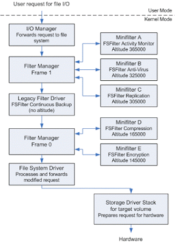

# Filter Manager
+ 필터 매니저(FltMgr)는 윈도우 운영체제를 설치할 때 같이 설치되며, 미니 필터 드라이버가 로드 될 때만 활성화됨.
+ 필터 매니저는 대상 볼륨(Target Volume)의 파일 시스템 디바이스 스택에 레거시 필터 드라이버로 연결 함.
+ 미니 필터 드라이버는 필터 매니저에 콜백 루틴을 등록해서 간접적으로 파일 시스템 디바이스 스택에 연결하고, 작업 전(PRE), 작업 후(POST) 콜백 루틴을 등록해서 I/O작업을 필터링 할 수 있음.



---

# Managing Contexts in a Minifilter Driver
+ `context`는 minifilter 드라이버에 의해 정의되고 필터관리자 객체와 연관 될 수 있는 구조
+ minifilter 드라이버는 다음 개체에 대한 컨텍스를 만들고 설정 할 수 있음
  - Instances
  - Volumes
  - Streams
  - Stream handles (file objects)
  - Windows Vista and later 이후 지원
    * Files
    * Transactions
+ 개체(Instances, Volumes, Streams, ...) 하나에 한 개의 필터 드라이버가 한 개의 컨텍스를 설정 할 수 있음.
+ **nonpaged pool**에서 반드시 할당 되어야 하는 **volume contexts**를 제외하고 나머지 contexts는 paged or nonpaged pool에서 할당 될 수 있음.
  - nonpaged pool(비페이징 풀)
    * 언제나 실제 메모리에 상주하여 어느 IRQL 수준에서나 어느 프로세스 컨텍스트에서나 페이지 폴트를 내지 않고 엑세스 할 수 있다고 보장된 시스템 가장 주소 영역
  - paged pool(페이징 풀)
    * 실제 메모리에서 제거되어 페이징 파일에 기록 될(page out)수도 있고 반대로 페이징 파일에서 실제 메모리로 올라올(Paged in)수 있는 시스템 공간의 가상 메모리 영역
    * 페이징 풀 메모리는 윈도우 운영체제와 장치 드라이버가 사용할 수 있도록 따로 비축한 메모리
+ 필터 관리자는 첨부된 객체가 삭제되거나, minifilter 드라이버 인스턴스가 볼륨에서 분리되거나, minifilter 드라이버가 언로드될 때 context를 자동으로 삭제함.

---

# Registering Context Types
+ minifilter 드라이버는 `DriverEntry` 루틴에서 `FltRegisterFilter` 를 호출 할 때 사용하고자 하는 각 유형의 컨텍스트를 반드시 등록 해야함.
+ context type을 등록하기 위해 minifilter 드라이버는 `FLT_CONTEXT_REGISTRATION` 구조체의 가변길이 배열을 만들고 minifilter 드라이버가 전달하는 `FLT_REGISTRATION` 구조체 중 `ContextRegistration`의 포인터를 저장합니다. 배열의 요소 순서는 중요 하지 않으나 배열의 마지막 요소는 `{FLT_CONTEXT_END}` 여야함.

+ `FLT_CONTEXT_REGISTRATION` 예제

```c
const FLT_CONTEXT_REGISTRATION ContextRegistration[] = {

    { FLT_INSTANCE_CONTEXT,
      0,
      CtxContextCleanup,
      CTX_INSTANCE_CONTEXT_SIZE,
      CTX_INSTANCE_CONTEXT_TAG },

    { FLT_FILE_CONTEXT,
      0,
      CtxContextCleanup,
      CTX_FILE_CONTEXT_SIZE,
      CTX_FILE_CONTEXT_TAG },

    { FLT_STREAM_CONTEXT,
      0,
      CtxContextCleanup,
      CTX_STREAM_CONTEXT_SIZE,
      CTX_STREAM_CONTEXT_TAG },

    { FLT_STREAMHANDLE_CONTEXT,
      0,
      CtxContextCleanup,
      CTX_STREAMHANDLE_CONTEXT_SIZE,
      CTX_STREAMHANDLE_CONTEXT_TAG },

    { FLT_CONTEXT_END }
};
```

---
+ 커널의 모든 메모리는 공유됨. 운여체제나, 드라이버를 개발할 땐 non-page 사용률을 최소화 시키는게 목표.
+ WorkItem 큐에 함수 실행 포인터가 존재 하고 DriverEntry의 주소를 큐에 넣고 Kernel Thread에서 큐에 있는걸 하나 꺼내서 실행
+ 페이지 아웃 이란건 사용 가능한 가상 메모리 주소를 충분히 확보 하는 것.
+ 컴파일러에게 코드를 특정한 섹션에 두라고 지시 하는 전통적인 방법은 `alloc_text`라는 pragma를 이용하는 것.
+ `alloc_text`는 함수 선언자와 명명된 함수에 대한 정의 사이에 사용 해야함.
+ INIT 섹션에 위치한 함수는 수행을 마치고 복귀하면 시스템은 이들 함수가 차지한 메모리를 해제함.

```c
#ifdef ALLOC_PRAGMA
#pragma alloc_text(PAGE, CtxFindOrCreateFileContext)
#pragma alloc_text(PAGE, CtxCreateFileContext)
#pragma alloc_text(PAGE, CtxFindOrCreateStreamContext)
#pragma alloc_text(PAGE, CtxCreateStreamContext)
#pragma alloc_text(PAGE, CtxUpdateNameInStreamContext)
#pragma alloc_text(PAGE, CtxCreateOrReplaceStreamHandleContext)
#pragma alloc_text(PAGE, CtxCreateStreamHandleContext)
#pragma alloc_text(PAGE, CtxUpdateNameInStreamHandleContext)
#endif
```
+ 윈도우는 선점형 멀티 태스크 운영체제
  - 선점형 멀티 태스크는 IRQL <= APC 이하 일 때만 적용됨.
  - `IRQL_LESS_OR_EQUAL`

```c
#define PAGED_CODE() PAGED_ASSERT(KeGetCurrentIrql() <= APC_LEVEL);
```

---
+ Page Fault & IRQL에 대한 이해

+ Q) arbitrary thread context??
  - HANDLE과 관련된 얘기 / ReadFileEx() 즉시 응답 / OVERAPPED IO / https://docs.microsoft.com/en-us/windows-hardware/drivers/kernel/previousmode / HandleTable / https://docs.microsoft.com/en-us/windows-hardware/drivers/ddi/content/wudfwdm/nf-wudfwdm-initializeobjectattributes
  - `OBJ_KERNEL_HANDLE flag`
  - 호출자의 context가 system인지, arbitary, system인지를 꼭 알아야한다. 왜냐? handle table땜에..OBJ_KERNEL_HANDLE flag값이 true이면 system process의 핸들 테이블에 등록, 아니면 호출 프로세스의 핸들 테이블에 등록
+ Q) `/D "POOL_NX_OPTIN=1"` 옵션을 주면 default로 executable이 차단

+ Duplicated Handle
  - Source 핸들이 가르키는 Object의 주소를 찾아서 복사 대상의 핸들 테이블에 넣어줌.
+ `IRP_Mj_CLEANUP`(caller context) / `IRP_MJ_CLOSE(aribitary or system)`, <br>
  `IRP_MJ_CREATE`(caller context)
+ CloseHandle(object refence count만 감소 시킴) / irp_mj_close(커널내의 가비지컬렉터가 오브젝트 레퍼런스가 0인걸 close시킴)
+ 커널에서 드라이버를 짤 때 내가 현재 무슨 작업을 하고 있는지/현재 어디에 있는지를을 명확히 알 고 있어야 정확한 드라이버 루틴을 처리 할 수 있음.
+ 캐시를 가지고 있..던가 뭐..어렵ㅋㅋㅋㅋ
+ `skipping_pagging_io` : pagging(페이징 파일) I/O에 대한 기록을 볼 것이냐 말것이냐...
+ `memory_mapped_io`를 모니터링하면 예측 불가능한 시점에 올라온다.
+ 개발 테스트 머신에서는 항상 verifier를 켜둬야한다.
+ registry cookie
  - 고유 식별값
  - 
+ Instance -> 드라이버 자체
